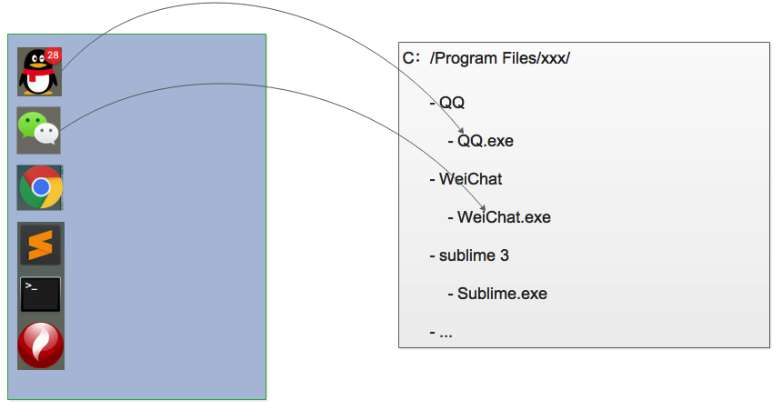

# CBIB Ubuntu Server Manual

| version | author | date       | diff  | other          |
| ------- | ------ | ---------- | ----- | -------------- |
| V1.0    | 王彬   | 2018.09.06 | Setup | initialization |

---

[TOC]

## 前言

       此指导书作为CBIB实验室公用Ubuntu服务器指导资料，包含但不局限于深度学习环境搭建、服务器运维、服务器日常维修、硬件维护、问题定位以及解决措施，仅供参考。**除此之外还配备常见FAQ**，见[README.md](./README.md)。希望以此传承下去，为后续师兄弟减少环境搭建工作量，节约学习时间。

**请历届管理员严格把守以下规则：**

-  服务其ip地址不得以任何形式对外泄露
- 不得将服务器账号租、借给实验室意外人员
- 不使用GPU（仅占用CPU）的项目不得使用服务器
- 实验室老成员毕业离校后，及时回收账号
- 同一项目同一程序一次不得使用超过4块GPU，特殊情况除外
- 任何人不得私自删除、升级**公用库**（cuda、cudnn、tensorflow、keras、pytorch、caffa等），需经过管理员和大家一致同意后方可升级
- 普通用户（非管路员）不得修改`/etc/profile`、`/etc/bashrc`等公共配置文件
- 每人限制一个服务器账号，不使用远程桌面（或使用频率低于2次/天）的用户，远程桌面应该处于常关状态
- 除管理员和负责人(金人超老师)以外，任何人不得使用root登录，root密码不得向任何人泄露
- 服务器机房每天必须检查一次，确保空调处于开启状态，室内温度不得超过40度
- 每隔一段时间要检查服务器机架后侧电线，防止温度过高造成电线老化漏电

----

此项目自2018.9.6发起，手册开源于github，由每一届服务器运维管理员负责维护。

> 2017.9~2018.9   管理员codewang， github地址<https://github.com/codewanghust/CBIB_Server_Manual>

---


## 第一章  服务器介绍

      **Note：**后文中Linux发行版特指Ubuntu.本手册只提供命令行操作指导，不提供图像界面操作指导。

### 1.1 硬件

       实验室目前共2台大服务器（10-GPU），2台小服务器（2-GPU）。其硬件配置如表1-1所示。

| 服务器编号 |   俗名    | GPU数量 |       GPU型号       | 显存 | 内存  | 硬盘 |                           CPU型号                            | 负责人 |
| :--------: | :-------: | :-----: | :-----------------: | :--: | :---: | :--: | :----------------------------------------------------------: | :----: |
|     1      | 老服务器  |   10    | GeForce GTX 1080 Ti | 12GB | 128GB | 12TB | `Intel(R) Xeon(R) CPU E5-2683 v3 @ 2.00GHz（2CPU-28核-64bit）` | 曹海潮 |
|     2      | 新服务器  |   10    | GeForce GTX 1080 Ti | 12GB | 128GB | 4TB  | `Intel(R) Xeon(R) CPU E5-2683 v3 @ 2.00GHz（2CPU-28核-64bit）` |  王彬  |
|     3      | 小服务器1 |    2    | GeForce GTX 1080 Ti | 12GB | 64GB  | 2TB  | `Intel(R) Xeon(R) CPU E5-2603 v4 @ 1.70GHz (1GPU-6核-64bit)` |  王彬  |
|     4      | 小服务器2 |         | GeForce GTX 1080 Ti | 12GB | 64GB  | 2TB  | `Intel(R) Xeon(R) CPU E5-2603 v4 @ 1.70GHz (1GPU-6核-64bit)` | 陆建国 |

<center> 表1-1 服务器硬件配置表 </center>

其中：

- 1号**老服务器**位于机房-服务器机架从上往下第一台（无外接显示器，无键鼠，与2号公用）
- 2号**新服务器**位于机房-服务器机架从上往下第二台（有外接显示器，有键鼠）
- 3号**小服务器1**位于实验室-进门第4排-右数4号桌（有外接显示器，有键鼠）
- 4号**小服务器2**位于机房-进门空调旁边（无外接显示器，无键鼠）

### 1.2 软件

        软件配置涉及到大家的深度学习平台，格外重要。请管理员及时维护此表（表1-2），一旦出现私自更新、删除公用库可按照此表进行恢复。**这里只统计公用数据库，公用库，公用应用程序, \*表示未统计项，或不重要**

|     软件名称     |           1号            |           2号            |                3号                |                 4号                 | 表项维护人@维护日期 |
| :--------------: | :----------------------: | :----------------------: | :-------------------------------: | :---------------------------------: | :-----------------: |
|       `OS`       | `Ubuntu LTS 14.04(出厂)` | `Ubuntu LTS 14.04(出厂)` | `Ubuntu LTS 16.04  (王彬@2018.6)` | `Ubuntu LTS 16.04（陆建国@2018.6）` | `codewang@2018.9.6` |
|      `CUDA`      |          `9.0`           |          `8.0`           |               `9.0`               |                `9.0`                | `codewang@2018.9.6` |
|     `cudnn`      |           `*`            |           `*`            |               `8.5`               |                 `*`                 | `codewang@2018.9.6` |
| `nvidia-driver`  |        `384.130`         |         `384.69`         |             `384.130`             |                 `*`                 | `codewang@2018.9.6` |
|    `python3`     |         `3.4.3`          |         `3.4.3`          |              `3.6.5`              |                 `*`                 | `codewang@2018.9.6` |
| `Tensorflow`-gpu |         `1.3.0`          |         `1.4.0`          |              `1.8.0`              |                 `*`                 | `codewang@2018.9.6` |
|  `Tensorboard`   |         `0.1.8`          |         `0.4.0`          |              `1.8.0`              |                 `*`                 | `codewang@2018.9.6` |
|     `Keras`      |         `2.0.8`          |         `2.1.6`          |              `2.2.0`              |                 `*`                 | `codewang@2018.9.6` |
|    `Pytorch`     |           `无`           |         `0.1.0`          |                `*`                |                 `*`                 | `codewang@2018.9.6` |
|     `Caffa`      |           `*`            |           `*`            |               `无`                |                 `*`                 | `codewang@2018.9.6` |
|     `Theano`     |           `*`            |         `1.0.2`          |               `无`                |                 `*`                 | `codewang@2018.9.6` |
|     `Mxnet`      |           `*`            |      `1.1.0.post0`       |               `无`                |                 `*`                 | `codewang@2018.9.6` |
|    `xgboost`     |         `0.6a2`          |          `0.71`          |               `无`                |                 `*`                 | `codewang@2018.9.6` |
|    `ipython`     |         `6.2.1`          |         `6.2.1`          |              `6.4.0`              |                 `*`                 | `codewang@2018.9.6` |
|     `Cython`     |         `0.27.3`         |         `0.27.3`         |             `0.28.2`              |                 `*`                 | `codewang@2018.9.6` |

<center> 表1-2 服务器软件配置表 </center>

### 1.3 IP地址

IP地址是向学校申请的固定IP地址，如表1-3所示，校内任何地方均可以访问。**切记不可将服务IP地址告诉他人。**

| 编号 |     IP地址      |
| :--: | :-------------: |
| 1号  | xxx.xxx.xxx.253 |
| 2号  | xxx.xxx.xxx.232 |
| 3号  | xxx.xxx.xxx.226 |
| 4号  | xxx.xxx.xxx.225 |

<center> 表1-3 服务器IP配置表 </center> 

---


## 第二章 服务器配置

本章内容包括：

- 如何安装cuda、cudnn、tensorflow-gpu等深度学习框架，以及其配置过程
- 常用软件安装配置
- 固定IP配置
- 远程桌面配置<需配合第三章 Linux运维，可先阅读第三章>

### 2.1 深度学习框架配置

       由于实验室项目不尽相同，不同的项目组可能会使用不同的深度学习框架，管理员只需用维护tensorflow和keras即可。但是cuda、cudnn是所有框架公用的，所以升级和维护需要实现与各项目组沟通协调。目前实验室所使用的深度学习框架包括：`keras with tensorflow-backend`(刘老师、马老师项目组)、`caffa`（金老师项目组）、`matlab`（许老师项目组）、`other`，下面主要介绍cudnn、cuda以及tensorflow和keras的安装配置。

#### 2.1.1 深度学习库依赖关系

       我们知道CPU也好、GPU也好、硬盘、内存都是物理设备都属于硬件，那么操作系统或者计算机软件想要使用这些硬件，就需要驱动程序，这和Window是一样的。（虽然windows上有许多设备是免驱的，但是实质上他们使用的是公用驱动，万能驱动。比如鼠标、蓝牙键盘等，其实他们都是使用默认的USB设备驱动程序，所以可以免驱），所以我们想要使用GPU首先需要安装**驱动程序**。

       除此之外，tensorflow这样的深度学习框架也不可能直接和GPU驱动程序打交道，不然tensorflow的软件体量就太大了，所以NVIDIA公司为这些上层应用软件提供了一些辅助程序，称之为**cuda**和**cudnn**。

       然后就是我们熟悉的深度学习框架了，比如tensorflow、pytorch、mxnet、caffa等,**注意，Keras严格意义上来说并不是深度学习框架，它是以tensorflow或者theaon后后端的高级封装API库。**下面我们用一副图来了解它们的关系。如图2-1所示：


<center>图2-1 深度学习库依赖关系</center>

#### 2.1.2 Linux加载库过程简介

​        本节，我将通过类比windows应用程序来解释Linux系统是如果启动应用程序，如何加载动态链接库的。假设我们在windows上安装一个QQ软件，其步骤如下：

- 下载QQ安装包，一般为`.exe`
- 安装
  - 选择安装位置，默认为`C:/Program files/xxx`
  - 创建桌面快捷方式
  - 安装完成
- 启动应用程序

实质上我们选择安装路径时，安装程序会将QQ安装包的内容，所需要的库文件，数据库等拷贝到我们指定的目录下，同时还会设置注册表（这个不清楚没关系）。然后创建桌面快捷方式比如`/Desktop/QQ`,当我们点击运行`QQ(快捷方式)`时系统会找到此快捷方式所指定的应用程序，也就是`C:/Program Files/xxx/QQ.exe`,然后就完成启动了。



Linux下的程序启动与Window类似，但也有些不同，首先linux不存在快捷方式，那么问题就来,linux是如何找到对应的应用程序的呢？

> Linux下启动应用程序，系统会根据环境变量 **PATH** 指定的路径，取对应的路径下查找应用程序。
>
> 我们可以使用echo命令查看环境变量：
>
> `echo $PATH`    `<--- $ 表示读取环境变量， echo是输出显示命令`
>
> (2号服务器)输出为：
>
> `/usr/local/MATLAB/R2014b/bin:/usr/local/cuda-8.0/bin:/usr/local/sbin:/usr/local/bin:/usr/sbin:/usr/bin:/sbin:/bin:/usr/games:/usr/local/games:/usr/lib/jvm/java-8-oracle/bin:/usr/lib/jvm/java-8-oracle/db/bin:/usr/lib/jvm/java-8-oracle/jre/bin`
>
> ---------
>
> 我们可以看到PATH环境变量中有很多路径，用 **: (冒号)**隔开，那么假设当我们在终端键入 `ls`命令时，实质上Linux系统会去这些路径下查找名称为`ls`的应用程序（默认优先查找当前路径`.`），最终会在`usr/local/bin/`找到`ls`程序，然后调用它，所以说我们运行`ls`其实是运行`/usr/local/bin/ls`.


那么同样的道理，如果程序需要加载某个动态链接库，那么它会去哪些路径下查找呢？答案是**LD_LIBRARY_PATH**


#### 2.1.3 Linux环境变量的配置

上面我们讲了Linux运行应用程序和加载动态链接库时所依赖的两个环境变量，下面我们讲解如何设置环境变量，每个用户的环境变量有什么区别?

首先我要强调一点，**Linux系统不是桌面系统，其设计之初就不是为日常办公而设计，它是一种多用户的服务器型的操作系统**，既然Linux是多用的操作系统，那么问题就随之而来，假如某台服务器上有AB两个用户，A用户安装了一个QQ轻量版并且设置了`PATH`环境变量，B用户又想使用完整版的QQ，于是他也下载安装了完整版的QQ，也设置了环境变量`PATH`， 那么这就造成的冲突。因此**Linux中每个用户的环境变量都是独立的！**

**a) 如何设置环境变量  ---> export**

Linux中我们使用`export`命令来设置环境变量，但是要主要环境变量有它自己的生命周期。设置的环境变量有效期直至当机器**重新启动**或者该环境变量被**覆盖**、被**删除**时。我们可以再命令行中使用`export`命令来设置环境变量，下面我们看一个例子：

``` shell
[codewang$] echo $HELLO_WORLD    --> 查看环境变量 `HELLO_WORLD`
                                 --> 该用户的该环境变量不存在，或者为空 
[codewang$] export HELLO_WORLD='never fight alone'   --> 定义环境变量
[codewang$] echo $HELLO_WORLD
never fight alone    --> 可以看到已经设置成功
  
[codewang$] logout   --> 退出登录
----------------------------------------------------------------
我们切换登录另一个用户 user
[user$] echo $HELLO_WORLD   --> 查看环境变量 `HELLO_WORLD`
                            --> 不存在，这也说明了用户的环境变量是独立的。
[user$]  
```

**b) 脚本设置环境变量  --> /home/username/.bashrc**

上面介绍了使用`export`来设置环境变量，但是也面临着一个问题，一旦机器重启那我们就得重新设置环境变量，这岂不是很麻烦，好在Linux系统在启动时会自动运行一些脚本(有兴趣的同学可以查阅相应资料)，在系统启动、或者用户登录时系统自动运行该用户`home`下的`.bashrc`脚本（shell 脚本）。所以每个用户都可以自己定制自己的启动脚本，那么我们就可以在该脚本中设置环境变量，就不用再操心系统重新的问题了。

``` shell
[codewang$] vim ~/.bashrc   --> ~的意思是当前用户的home目录，等价于/home/codewang
 
 -+-+-+-+-+-+-+-+ 以下为 /home/codewang/.bashrc 文件的内容 -+-+-+-+-+-+-+-+
 export PATH=xxx
 export LD_LIBRARY_PATH=xxx
 export HELLO_WORLD=xxx


 关于vim的使用，读者自行查阅资料。
 -+-+-+-+-+-+-+-+-+-+-+-+-+-+-+-+-+-+-+-+-+-+-+-+-+-+-+-+-+-+-+-+-+-+-+-+
```

**Note：**当我们编辑保存该脚本后，它要在系统重新或者用户登录时才会被调用，如果你编辑了该文件想立即生效那么我们可以运行`source`命令：`[codewang$] source ~/.bashrc`

**C) 通用环境变量配置 --> /etc/profile**

服务器上有很多大家公用的软件，公用的库文件，难道每个用户都要自己去一一配置环境变量吗？一旦某个库更新了，管理员要一个用户一个用户的取修改他们的`.bashrc`文件吗？这当然是不能忍受的。Linux在启动时还会调用一个脚本文件`/etc/profile`,它和每个用户目录下的`.bashrc`类似，区别在于**它设置的环境变量对所有用户有效！！！并且先于每个用户的.bashrc运行**

- 对所有用户有效

  我们可以很方便的为所有用户设置公共软件路径，公共库路径，例如tensorflow、cuda等公共库，管理员就可以设置`/etc/profile`来为所有用户设置`PATH和LD_LIBRARY_PATH`环境变量

- 先于每个用户的`.bashrc`运行

  这也说明了，如果`profile`中为每个用户设定了`PATH`,而某个用户自己的`.bashrc`也设置了`PATH`环境变量，那么**后者会覆盖前者**。

好了，设置环境变量就介绍这么多，其实linux设置环境变量的方式不止以上几种，但是我们常用的就是上面的方式，有兴趣的同学可以自行查阅相关资料。下面我们通过实例说明该如何**有效**的设置环境变量.

> 让我们先做以下假设：
>
> - 管理员在 `/usr/local/cuda`下安装了`cuda8.0`, 其中cdua的应用程序在`bin`目录下，库文件在`lib64`目录下。
> - `codewang`觉得`cuda8.0`太老旧了，自己想使用`cuda9.0`,并下载安装了`cuda9.0`安装在了`/usr/local/cuda-9.0`下面，同样的应用程序在`bin`目录下，库文件在`lib64`目录下。
>
> **管理员**
>
> 作为管理员，只要用户不破坏公共库，公共资源，原则上用户有使用任何版本的软件的自由，所以管理员
>
> 只能操作`/etc/profile`文件，不可擅自改动某个用户的`/home/username/.bashrc`文件,普通用户也不可以擅自修改`/etc/profile`文件。
>
> ``` shell
> ----- 以下为标准的/etc/profile文件配置 -----
> 
> # modified by codewang @2018.09.07     --> 修改文件添加备注，这是管理员的责任
> export PATH=$PATH:/usr/local/cuda/bin  
> export LD_LIBRARY_PATH=$LD_LIBRARY_PATH:/usr/local/cuda/lib64
> 
> # 解释
> # export PATH=$PATH:/usr/local/cuda/bin  
> # 首先PATH=$PATH  也就是等于原内容，然后后面追加内容，我们之前讲过多个路径用冒号隔开
> # 因此该命令的含义为：给PATH后面追加:/usr/local/cuda/bin
> # 这样就不会覆盖原来的环境变量了
> ```
>
> **codewang**
>
> 上面管理员为所有用户配置了`PATH和LD_LIBRARY_PATH`,但是我不想用`cuda8.0`，所以我可以通过设置我自己的环境变量来实现，同时还不影响其他用户。因此我只需用设置我自己的`.bashrc`文件即可。
>
> ``` shell
> ----- 以下为 codewang 的个人定制 ~/.bashrc 文件内容 -----
> 
> export PATH=$PATH:/usr/local/cuda-9.0/bin  
> export LD_LIBRARY_PATH=$LD_LIBRARY_PATH:/usr/local/cuda-9.0/lib64
> 
> # 解释
> # 管理员设置了两个环境变量，我又在后面追加我自己想用的cuda9.0
> # 这样，我的环境变量就包含了cuda8.0和cuda9.0， tensorflow依赖
> # 哪个版本它会自己查找的。
> #
> # 如果 codewang想强制只使用cuda9.0，不想使用管理员设置的cuda8.0怎么办？
> # 其实很简单：
> #  1. 首先 echo $PATH 查看当前环境变量内容
> #  2. 替换掉对于内容即可(cuda替换为cuda-9.0)
> # 或者：
> export PATH=/usr/local/cuda-9.0/bin:$PATH  
> export LD_LIBRARY_PATH=/usr/local/cuda-9.0/lib64:$LD_LIBRARY_PATH
> #我把自己想用的库放在环境变量的最前面，那么系统在搜索库时就会优先所有我指定的啦。
> ```
>
> 实质上，指定不同版本的python、不同版本的tensorflow或者是anacanda等都是这个原理。


#### 2.1.4 CUDA、cudnn安装配置


---


## 第三章 Linux运维


---


## 第四章 服务器管理


------

## 第五章 常见问题及解决方案

**此部分单独成册，见README.md**

